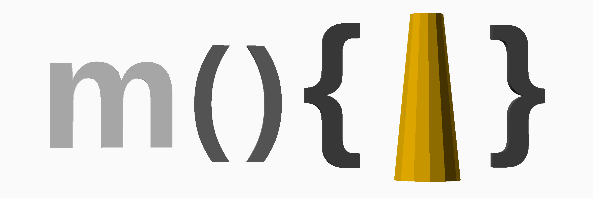
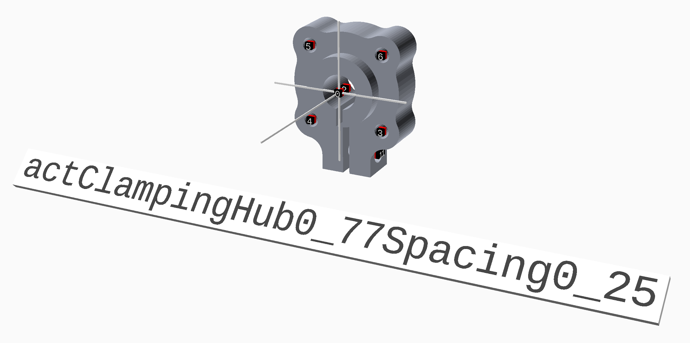

# Mocad Library

## Introduction

This is the **Mocad Library** (hereafter just **Mocad**), a set of functions, modules and part libraries based on the brilliant **OpenSCAD**.

With **Mocad** and OpenSCAD, in a few lines of code, you can build complex mechanical devices.


In **Mocad**, Parts can be made in a variety of different styles, but what they share in common is that they also describe various positions of interest.



These **Positions** can be manipulated, to connect parts together and to perform other calculations.

## Audience

People who might be interested in **Mocad** are people who like OpenSCAD - the idea of using code to create CAD projects, and who additionally would like to use some of the libraries and helper functions Mocad has to offer.

Anyone who currently is working with mechanisms of any kind and who thinks perhaps doing CAD should be more like writing code might find this library intriguing.

People who are not coders, or who do not want to learn to code, probably won't like this library.  At all.

## Installation

A prequisite to using **Mocad** is the installation of OpenSCAD.  OpenSCAD is available for free for Mac, Windows and Linux platforms, and can be found here:

[OpenSCAD Downloads](http://www.openscad.org/downloads.html)

With OpenSCAD installed, one can either download this repository's zip, or clone just clone it.

OpenSCAD will function on relatively modest machines, however, to load large arrays of files - such as some of the Mocad Part Library index files, higher end machines may be required.  One hint should always be born in mind - text labels are quite complex graphically.  A scene that won't function at all on a particular machine may work just fine with text turned off.

To do this, set ```moText = false``` in ```mo/mo.scad```

## Versions

This code is not yet versioned.  Consider it alpha quality.  At the appropriate time, it will get released as a 1.0 and a corresponding branch created.

## Testing

This code has been developed on Mac and Linux.  No formal testing mechanisms are present.  

An excellent test for the integrity of the various internal modules and functions is to open the tutorial code.  

[Tutorial OpenSCAD Code](tutorial/moTutorial.scad)

If all seems well in there, it is likely things are OK with the codebase.

## User Guide

There is a short user guide outlining the various features and giving some flavor of **Mocad** here:

[User Guide](doc/userguide.md)

## Reference

Reference documentation, including Mocad functions and modules part design, directory layout, etc. is here:

[Reference](doc/reference.md)

## Tutorial

There is also a tutorial - a very quick overview of OpenSCAD followed by a lengthy run through of the basic principles of Mocad.

[Tutorial](tutorial/tutorial.md)

All code discussed in the tutorial

## Related Resources

### OpenSCAD
- [Home](http://www.openscad.org)
- [Downloads](http://www.openscad.org/downloads.html)
- [Documentation](http://www.openscad.org/documentation.html)
- [MakerBlock's Tutorials](http://www.makerbot.com/tutorials/openscad-tutorials)

### OpenSCAD Parts
- [Thingiverse Parts](http://www.thingiverse.com/openscad/collections/libraries)
- [Shapeways Parts](http://www.shapeways.com/search?q=openscad)

### Actobotics
- [Servo City](https://www.servocity.com/html/actoboticstm.html)
- [SparkFun](https://www.sparkfun.com/actobotics)

## Acknowledgements

The team that creates OpenSCAD are the major enablers of this project.  The environment keeps getting better and better.

There are other "Connector" libraries, although Mocad was developed independently.  The ultimate structure of the **Mocad** **Position** was decided by consulting Obiscad:

[Obiscad attach.scad](https://github.com/Obijuan/obiscad/blob/master/obiscad/attach.scad)
